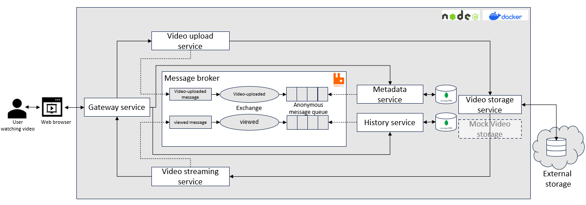

# Video Streaming Application

This is an simple application that stream video clips with microservices architectual.

You need Docker and Docker-Compose installed to run this.

Boot it up from the terminal using:

    docker-compose up --build

You must now load the videos collection with ./scripts/mongodb.json into video-streaming database. You can do this using Robo 3T or mongoimport.

Then point your browser at http://localhost:4002/video?id=5d9e690ad76fe06a3d7ae416

## Kubernetese
Kubernetes authentication (kubeconfig):

    az aks get-credentials --resource-group <your-app-name> --name <your-app-name